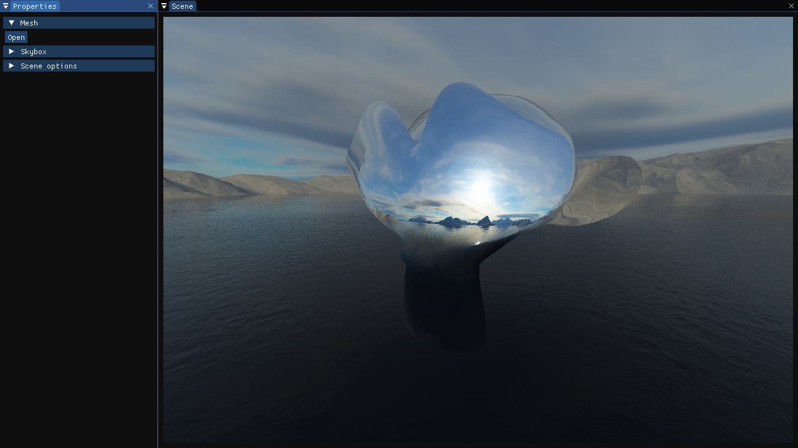

# Sirius




## Introduction

*Sirius* is a general-purpose, 
3D-oriented graphics library based 
on OpenGL. It serves mainly as a 
tool to learn graphics programming, 
but is intended on the long term to
be powerful and simple enough to be
used as a graphics engine for games,
3D rendering or physics simulations.

## Installation
### Getting started

The library is untested on any development
environment other than Windows with MinGW-w64. C++20
support is required.

### Building from sources

To build the library, you will first have
to make sure that you have the last version
of CMake installed on your computer. If
that isn't the case, you can download the 
binaries [here](https://cmake.org/download/).

Then, you will have to download the library
sources. You can click on the **Code** button
on the upper-right corner and either download
the repository's ZIP file, or clone
it with the following commands:

```shell
git clone https://github.com/Epsylene/Sirius.git
cd Sirius
git submodule init
git submodule update
```

Then you have to tell CMake to generate
the configuration files for your compiler,
as well as the installation prefix for the
library files. You can do it with the CMake
GUI, or via the CLI. In the last case, the
command looks like this:

```shell
cmake -G "GENERATOR" SOURCE_DIR
```

You have:
* GENERATOR: determines for which
  compiler the makefiles are going to be 
  generated (on Windows, if you are using
  MinGW or MinGW-w64, type "MinGW Makefiles";
  if you are using Visual Studio, you can search for 
  your version's CMake generator, but it should be the
  one chosen by default);

* SOURCE_DIR: the path of the cloned
  repository's folder;

* GEN_DIR: the directory where you want to generate your build files.

After that, the last thing you have to do is to run this
command:

```shell
cmake --install BUILD_DIR --prefix INSTALL_DIR
```

Where:
* BUILD_DIR is the directory where the cmake_install.cmake file is located ;

* INSTALL_DIR is the directory where you want to install the library.

If you got no errors, then, congratulations ! You have succesfuly installed the library.

### Linking the library

All you need is in the library install path.
Copy-paste it into your project, and add the
following lines to your CMakeLists.txt:

```cmake
add_definitions(-DGLFW_INCLUDE_NONE)

add_subdirectory(lib/Sirius)

target_link_libraries(${YOUR_TARGET} Sirius)
target_compile_definitions(Sirius PUBLIC -DSRS_APP_DIR=${CMAKE_CURRENT_SOURCE_DIR})
target_include_directories(${YOUR_TARGET} PUBLIC ${SIRIUS_INCLUDE_DIRS})
```

Finally, go to *"Sirius/bin"*, grab the *libSirius.dll*, *libassimp.dll* files, and paste them next to
your executable (or copy them with the CMake copy functions
that you can find in the example *app/CMakeLists.txt*).

## Credits

The library's core features were at first
derived from [The Cherno's
Game Engine series](https://www.youtube.com/playlist?list=PLlrATfBNZ98dC-V-N3m0Go4deliWHPFwT),
which is a great ressource not only on
the technicalities of a game engine,
but also the design issues that are faced
when writing a library. On the other hand, 
Joey de Vrie's [Learn OpenGL](https://learnopengl.com/) 
has been extremely useful to understand the OpenGL concepts
and objects I wanted to implement. Make sure to go check both !

Sirius uses OpenGL, [glad](https://glad.dav1d.de/), [GLFW](https://www.glfw.org/),
[Assimp](https://www.assimp.org/), [Dear ImGui](https://github.com/ocornut/imgui),
[stb_image](https://github.com/nothings/stb/blob/master/stb_image.h), 
[magic_enum](https://github.com/Neargye/magic_enum) 
and [fmt](https://github.com/fmtlib/fmt).
